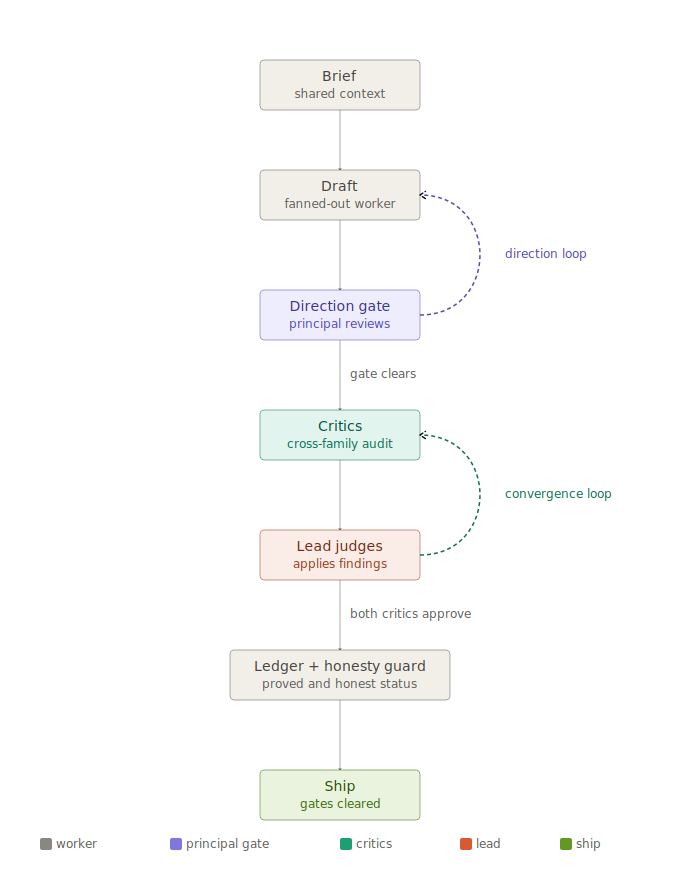
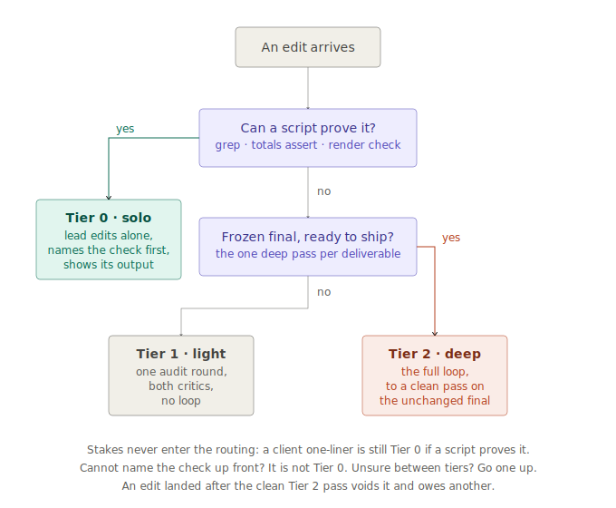

# crosscheck-loop

A multi-model build loop with an adversarial audit and a hard stop condition, for
high-stakes **business deliverables**: proposals, pitches, RFP responses, plans, reports,
client analyses.

Code has compilers, tests, and CI: deterministic verifiers that catch a wrong build before
it ships. A proposal has none of that. The only check on a wrong number, a fabricated
citation, or a confident overclaim is another set of eyes, and one model reviewing its own
work is too easy on itself. crosscheck splits the build across model families so the
builder is never its own judge, then refuses to call the job done until the critics have
signed off on the exact file you are about to ship. It is a method first and a reference
script second: the loop design below is model-agnostic, and `glm_fanout.py` is just one
cheap way to run the drafting step.



The loop is two cycles, not a straight pipeline: a **direction loop** (structural feedback sends
the draft back before critics ever burn a round) and a **convergence loop** (the lead and critics
go back and forth until both approve the exact same file). Steps read as a numbered list below
because that is the easiest way to describe them once, not because the run only goes through them
once.

## What it's for

Deliverables where being wrong is expensive, no automated verifier exists, and one model's
self-review is not enough:

- A proposal, pitch, or RFP response where a wrong figure or an overclaim costs the deal.
- A report or plan whose claims must trace to real sources (the loop's fabrication hunt
  is aimed at exactly this).
- A data-heavy artifact (dashboard, analysis) where numbers have to reconcile across
  sections and sources have to hold up.

It is NOT primarily a coding tool. Code already has cheap deterministic verification
(compilers, tests, CI, linters); run those first and reach for a review loop only on top.
The one code-shaped case the loop covers well is the artifact that IS the deliverable, a
built HTML deck or dashboard, where a render critic catches what prose review misses.

If the task is a quick one-liner, skip it. The team is overhead until the build is big
enough to earn it.

**Say which mode you want up front.** `light` runs one audit pass, for lower-stakes work.
`deep` (the default for anything that ships) loops steps 4 to 6 to a clean convergence pass.
If you wired this as an agent command or slash command, that is literally `/yourcommand light`
or `/yourcommand deep`; if you are just prompting an assistant directly, say "light mode" or
"deep mode" in the brief. Nothing reads your mind otherwise, and light mode silently run on a
client deliverable is how a ship-blocker gets through.

## The tier gate: route by verifiability, not stakes

The expensive failure mode in production was not skipping the loop. It was running the
full loop on small edits the lead could have proven correct with a script. The fix is a
three-tier gate in front of the loop, and one routing rule:

**Tier is chosen by verifiability and edit size, never by how high-stakes the work
feels.** A one-word fix on a client artifact is still Tier 0 if a script proves it.
Stakes alone never justify the loop; only "I cannot verify this myself" does.



| Tier | Trigger | What runs |
|---|---|---|
| 0 · solo-verify | the change is deterministic and provable with a script (grep, totals assert, numeric parity, render check) | the lead alone, who then shows the check's output |
| 1 · single cross-check (= `light`) | a judgment call, or many figures, but bounded scope | one audit round, both critics, no loop |
| 2 · deep loop (= `deep`) | the ship gate on the frozen final | the full loop, to a clean convergence pass |

Tier 0 has the same bright line as bulk hands: state the mechanical pass/fail check
BEFORE making the edit, run it after, show the output. "I feel fast enough" is not
Tier 0; "the grep returns zero and the totals assert passes" is. If you cannot name the
check up front, it is not Tier 0.

Tier 1 keeps the cross-family rule: one round of both critics, never a single critic
alone, so the cheap tier cannot pass a single-family blind spot.

**One Tier 2 per deliverable, fired by the freeze.** The deep loop runs when the artifact
is declared frozen for ship, not once per edit. Mid-build edits route Tier 0 or 1. An
edit landed after the clean pass still voids it. What Tier 2 can never be skipped for:
whatever is not solo-verifiable at ship time — cross-source reconciliation, translation
fidelity, narrative overclaims. In our production runs, every critic catch that earned
its cost was in that class; every wasted loop was on a script-provable edit.

Default when the caller says nothing: the lowest tier the change's verifiability allows,
stated in one line with the check before running. Unsure between tiers, go one up.

## Do you have to use specific models?

No. The only hard rule is **cross-family**: the critics must be a different model family
than the builder, because a same-family critic shares the builder's blind spots. Which
vendors you use is entirely up to whatever API keys you already have. The structure is the
value, not the brand of model in each seat.

## Ground rule: no fabrication

This sits above the whole loop. Every fact, number, quote, citation, date, and named entity
in the output must trace to a real source the team actually saw. Inventing one, even a
plausible one, is a ship-blocker, not a style nit. When a value is unknown: leave the cell
blank and flagged, research it, and if it still cannot be grounded, surface it as an open
question. An honest "unknown, needs a source" beats a confident guess every time. Synthetic
or illustrative content (placeholder data, sample numbers, mock copy) is allowed only when
explicitly requested, and is labelled as synthetic so it is never mistaken for real. The
drafters are told this in the brief, and the critics hunt unsupported claims as the
highest-priority finding.

## The loop

1. **Draft (worker, fanned out).** A fast, cheap model drafts N variants in parallel from
   one shared brief. On a *modification* (editing a locked file) it delta-drafts only the
   changed region instead of N full rewrites. The drafter never judges and never ships.
2. **Optional data deputy (worker).** On figure-heavy builds, a second worker pulls
   sources, builds the number tables, and populates the requirement ledger. Hard boundary:
   **it populates, it never signs off.** A worker never verifies its own data pull, so the
   adversarial critics still run on everything it filled. Its "do not use X" caveats fold
   into the brief as binding build constraints, not just ledger rows, so the builder is
   bound before the build, not only caught at audit.
3. **Principal direction gate (human, default-on for new builds).** Before any critic burns
   a round, the human principal reviews the synthesized draft for direction: intent, framing,
   taste. This is the one failure class critics cannot catch, because they verify against the
   brief, not against what the principal actually wanted. Structural feedback (add or kill a
   section, reframe the narrative, change data sources) loops cheaply here while the critics
   stay idle. The gate locks only on a round with zero change requests; if the lead is unsure
   whether a piece of feedback is structural, it is structural. The gate never hard-blocks:
   if the principal is not available, proceed to the critics and flag the skipped gate in the
   final report. Direction feedback that lands after a clean convergence pass voids that pass
   like any other edit. Skip the gate on small modifications and quick passes.
4. **Adversarial critics, cross-family.** At least two critics on a *different model family*
   than the builder, told to break the work, not bless it. Cross-family matters: a critic
   from the same family as the builder shares its blind spots. Task them explicitly to flag
   any number, quote, citation, or named entity with no traceable source as a suspected
   fabrication, the highest-priority finding class. On code-bearing builds, give one critic a
   render/technical lens (it catches the regression class prose critics miss, e.g. a CSS bar
   fill computing to 0px). The cross-family catch is load-bearing: if your only cross-family
   critic errors or is unavailable, substitute another family or report the run as
   unverified. Never let a single-family run pass silently as converged.
5. **Lead judges and loops to convergence.** The lead applies the real findings and
   re-submits the WHOLE file, not just the changed section, so critics catch internal
   inconsistencies an edit leaves behind (a claim that referenced data another round just
   removed, a stat that no longer matches an updated table), not only the specific finding
   that triggered the edit. **The loop is not done until both critics approve the same
   unchanged final.** Any edit after a clean pass voids that pass, so the file you ship is
   one the critics actually saw, not one edited past their last look. What this does not
   catch: a version that is internally consistent but has drifted from the framing or
   emphasis you actually wanted, that is a taste failure, not a correctness failure, which
   is what the direction gate above exists to catch instead.
6. **Requirement ledger.** One row per must-have, each marked proved / weak / missing /
   contradicted before ship. This catches the gap critics cannot see: the must-have nobody
   put on the page. On for correctness-critical builds (RFPs, anything with a spec).
7. **Honesty guard.** A run that hit its round cap, stalled in a two-round stalemate, or
   errored out is reported as exactly that. It is never relabelled "approved."
8. **Gate trivial work back to solo.** If the task is a one-liner, the team is overhead.
   Run the loop only when the build is big enough to earn it. The tier gate above is the
   full version of this rule: solo is fine whenever a script can prove the edit, and the
   proof is shown, not assumed.

## Why it works

Adversarial + different model family + loop-to-clean is about 80 percent of the lift. The
cheap parallel drafting is an accelerant, not the value. The stop condition (convergence +
ledger + honesty guard) is what keeps a plausible-but-wrong artifact from shipping.

## The seats

Fill each with any model you have access to; only the boundaries are fixed. Roles pin to
**tiers, not model IDs**, so a version bump never rots your setup.

| Seat | Job | Token profile | Hard boundary |
|---|---|---|---|
| **Principal (human)** | Gates direction: intent, framing, taste | Scarcest resource in the loop | Their approval never substitutes for the convergence pass |
| **Lead** | Briefs, judges, builds, enforces the stop | Accumulates the whole session: your largest recurring cost | Judge of record; never skips the critics |
| **Drafter** | Fans out N variants, or the delta on a modification | High volume, so cheapest capable tier | Never judges, never ships |
| **Data deputy** | Pulls sources, builds tables, fills the ledger | Bounded per build | Populates, never signs off |
| **Bulk hands** | Mechanical chores: parse, reformat, dedupe, liveness-check | Many small parallel calls, cheapest tier | Only tasks verifiable by mechanical diff; it transforms, never adjudicates |
| **Critic 1 (cross-family)** | Adversarial audit on a different family than the builder | Bounded packet per round | Load-bearing; if it is down, substitute a family or report unverified |
| **Critic 2 (fresh eyes)** | Second lens: craft, voice, gaps | Bounded packet per round | Never the only critic |
| **Escalation consult** | One-shot verdict on a judgment knot the loop stalemated on | Single bounded packet, premium model | Break-glass, not a step: advice to the lead, never a verdict of record |

Minimum to start: one API key for the drafter plus two critics on a different family than
the drafter. The critics can be two CLI tools you already have logged in (no extra keys).
A worked example spanning three families:

- Drafter: GLM via Ollama Cloud (`CROSSCHECK_API_KEY`)
- Critic 1: a `codex`-style CLI you are already signed into (GPT family)
- Critic 2: a Claude or Gemini subagent (a third family)
- Lead: whichever assistant you are already chatting with; you sit in the principal seat

If you only have two families total, run one critic per family and you still get the
cross-family catch.

**The escalation seat now exists as a platform primitive.** Anthropic's advisor tool
(beta, Claude API) lets an executor model consult a stronger model mid-generation,
server-side, in one request: exactly this seat, productized. If you run the loop via the
API, use it instead of hand-rolling the consult. Two boundaries carry over unchanged: the
advice informs the lead, it is never the verdict of record, and an advisor does NOT
replace the critics. An advisor is same-family planning help and shares the builder's
blind spots; the adversarial cross-family catch is a different job and stays mandatory.

## Seat economics

Token spend should follow judgment density, not volume. Three profiles:

- **Volume seats** (drafter, bulk hands): most of the tokens, least of the judgment. Put
  your cheapest capable model here; this is where a near-free model earns its keep.
- **Bounded seats** (critics, deputy): they see a packet per round, not the whole session,
  so a strong model here is affordable. Flat-fee CLI tools you already pay for are ideal.
- **The accumulating seat** (lead): it holds the brief, every draft, every critique, every
  round. This is your largest recurring cost, so the naive move of putting your most
  expensive model "in charge" is exactly the wrong economics.

Keep your most expensive model OUT of the resident lead seat. When the loop hits a genuine
judgment knot the critics stalemated on, send that model a **decision packet**: the specific
question plus minimal context, single-shot, no loop. If you find yourself consulting it more
than once per run, that is a signal to reseat, not to keep paying.

Every run opens by printing the roster (who sits in which seat, and any degradation, e.g. a
critic down or the direction gate skipped), so a mis-seating is visible in line one, not in
the bill.

The final report should close the loop the other way: one line on how many audit rounds ran
and which seat did the most work. This is not a new tracking system, it's just surfacing what
already happened, so the seat-economics theory above gets checked against real runs instead of
staying a paper assumption.

## glm_fanout.py

A reference implementation of step 1: parallel draft fan-out against any
OpenAI-compatible chat endpoint.

```sh
export CROSSCHECK_API_KEY=...            # your provider key
# optional: export CROSSCHECK_API_URL=https://your-endpoint/v1/chat/completions
python3 glm_fanout.py examples/job.example.json
```

`job.json`: `system`, `user`, `angles` (one variant per key), `out_prefix`, optional
`model`, `max_tokens`, `temperature`, `ext` (`md` or `html`). Auth and endpoint come from
the environment (see `.env.example`). Each angle runs in its own thread, so N variants
return concurrently. Run it as a background job.

The default endpoint targets [Ollama Cloud](https://ollama.com) with `glm-5.2`, chosen for
being near-free, long-context, and a third model family distinct from GPT and Claude (so it
makes a good cross-family worker). Any OpenAI-compatible provider and model works: set
`CROSSCHECK_API_URL` and the `model` field.

## Critics (reference setup)

The loop needs at least two adversarial critics on a different family than the builder. One
proven setup:

- A CLI coding agent (e.g. an OpenAI-family `codex exec`-style tool) as the technical critic.
  Copy the artifact's **whole folder** (HTML plus `assets/` and any locally referenced dirs)
  into a temp dir before review: a temp dir so it cannot touch the real file, the whole folder
  so local assets resolve on headless render (copying only the HTML false-flags images as
  missing).
- A fresh-eyes subagent on a third family, told to find what is wrong and return numbered
  findings with verbatim lines and fixes.

Swap in whatever critics you have, as long as they are adversarial and cross-family.

## Tuning note: compiled tool output is a draft, not a verdict

Deterministic compilers are great drafting accelerants: a chart compiler such as
[microsoft/flint-chart](https://github.com/microsoft/flint-chart) turns a ~10-line spec into a
full ECharts/Vega-Lite config, cutting drafting tokens and killing the hand-computed-layout bug
class. But treat compiled output like any other worker output:

- **Its defaults are not your theme.** Flint-compiled options ignore a top-level color palette
  and render the library's default colors; restyle at the level the compiler actually honors
  (per-series, in that case) to the deliverable's design system.
- **Verify the render, not the config.** Headless-render the chart (SSR to SVG works) and check
  the output (fill colors present, geometry non-zero) before it enters the convergence loop. A
  correct-looking option object proves nothing.
- The drafter does not need tool access to benefit: compact specs are plain text, so a cheap
  drafter authors them and the lead's toolchain compiles, restyles, and verifies.

## Config surface

`variants`, `directionGate` (principal reviews direction before the critics run; default on
for new builds, off for small modifications; never hard-blocks), `modificationMode`
(delta-draft the change, then regression-audit the whole file), `dataDeputy` (optional
worker that populates the ledger but never signs off), `bulkHands` (mechanical
diff-verifiable chores only), `criticModels` (at least two, cross-family; substitute a
family or report unverified if one is down), `escalationConsult` (break-glass single-shot
decision packet to your premium model; more than once per run means reseat),
`requireConvergence` (both critics approve the same unchanged final), `requirementLedger`
(on for correctness-critical builds), `stopOn` (clean pass, two-round stalemate, or cap,
never an errored run reported as clean), `maxAuditRounds`, `mode` (`light` is one audit
pass, `deep` loops to clean), `tier` (0 / 1 / 2, default auto: the lowest tier the
change's verifiability allows; Tier 0 requires naming the mechanical check up front and
showing its output; one Tier 2 per deliverable, fired by the freeze declaration).

## Status

Method, with two case validations and the tuning notes from each. This is the generalized
core; it is run in production behind domain-specific gates that are not published here.
Issues and PRs against the **loop design** are welcome (see CONTRIBUTING). It is not a
50-run-hardened framework, and the tuning notes are the most useful part: they are the
non-obvious failure modes you would otherwise hit yourself.

## License

MIT. See LICENSE.
