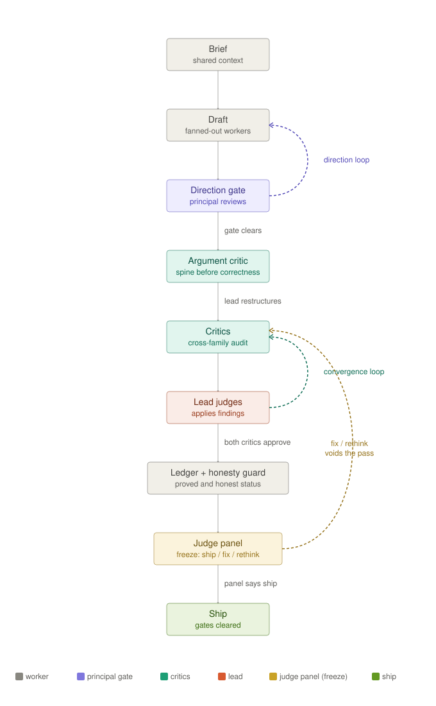
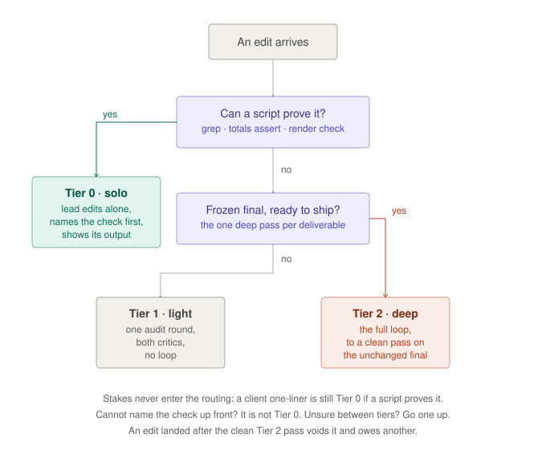
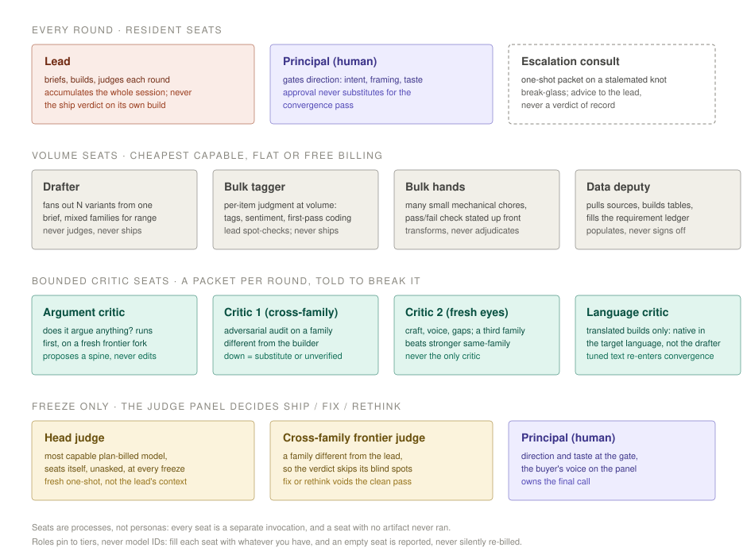

# crosscheck-loop

A multi-model build loop with an adversarial audit and a hard stop condition, for
high-stakes **business deliverables**: proposals, pitches, RFP responses, plans, reports,
client analyses.

Code has compilers, tests, and CI: deterministic verifiers that catch a wrong build before
it ships. A proposal has none of that. The only check on a wrong number, a fabricated
citation, or a confident overclaim is another set of eyes, and one model reviewing its own
work is too easy on itself. crosscheck splits the build across model families so the
builder is never its own judge, then refuses to call the job done until the critics have
signed off on the exact file you are about to ship. It is a method first and a reference
script second: the loop design below is model-agnostic, and `glm_fanout.py` is just one
cheap way to run the drafting step.



The loop is three cycles, not a straight pipeline: a **direction loop** (structural feedback sends
the draft back before critics ever burn a round), a **convergence loop** (the lead and critics
go back and forth until both approve the exact same file), and a **freeze loop** (a fix or rethink
verdict from the judge panel voids the clean pass and re-enters convergence). Steps read as a
numbered list below because that is the easiest way to describe them once, not because the run
only goes through them once.

## What it's for

Deliverables where being wrong is expensive, no automated verifier exists, and one model's
self-review is not enough:

- A proposal, pitch, or RFP response where a wrong figure or an overclaim costs the deal.
- A report or plan whose claims must trace to real sources (the loop's fabrication hunt
  is aimed at exactly this).
- A data-heavy artifact (dashboard, analysis) where numbers have to reconcile across
  sections and sources have to hold up.

It is NOT primarily a coding tool. Code already has cheap deterministic verification
(compilers, tests, CI, linters); run those first and reach for a review loop only on top.
The one code-shaped case the loop covers well is the artifact that IS the deliverable, a
built HTML deck or dashboard, where a render critic catches what prose review misses.

If the task is a quick one-liner, skip it. The team is overhead until the build is big
enough to earn it.

**Say which mode you want up front.** `light` runs one audit pass, for lower-stakes work.
`deep` (the default for anything that ships) loops steps 4 to 6 to a clean convergence pass.
If you wired this as an agent command or slash command, that is literally `/yourcommand light`
or `/yourcommand deep`; if you are just prompting an assistant directly, say "light mode" or
"deep mode" in the brief. Nothing reads your mind otherwise, and light mode silently run on a
client deliverable is how a ship-blocker gets through.

## The tier gate: route by verifiability, not stakes

The expensive failure mode in production was not skipping the loop. It was running the
full loop on small edits the lead could have proven correct with a script. The fix is a
three-tier gate in front of the loop, and one routing rule:

**Tier is chosen by verifiability and edit size, never by how high-stakes the work
feels.** A one-word fix on a client artifact is still Tier 0 if a script proves it.
Stakes alone never justify the loop; only "I cannot verify this myself" does.



| Tier | Trigger | What runs |
|---|---|---|
| 0 · solo-verify | the change is deterministic and provable with a script (grep, totals assert, numeric parity, render check) | the lead alone, who then shows the check's output |
| 1 · single cross-check (= `light`) | a judgment call, or many figures, but bounded scope | one audit round, both critics, no loop |
| 2 · deep loop (= `deep`) | the ship gate on the frozen final | the full loop, to a clean convergence pass |

Tier 0 has the same bright line as bulk hands: state the mechanical pass/fail check
BEFORE making the edit, run it after, show the output. "I feel fast enough" is not
Tier 0; "the grep returns zero and the totals assert passes" is. If you cannot name the
check up front, it is not Tier 0.

A typed check also counts as Tier 0 proof. When the check is a per-item judgment rather
than a string match (does this quote support this claim, is this verbatim on the stated
stance, is this headline number in the data table), write it as a yes/no or choice question
with criteria and run it over every item through a classifier that returns an answer plus a
probability. Show three numbers: items, answers that fail, answers below the confidence
threshold. Items below the threshold go to the lead's eyes, not to a critic, and the lead
spot-checks a sample of the confident answers too, the same rule the bulk tagger follows:
a classifier is proof only once its agreement on that question has been checked. This keeps
per-item correctness questions out of the expensive rounds.

Numbers in prose that drift from the data are a build problem, not a critic finding. When a
recompute changes a table, prose written earlier still quotes the old figure, and critics
spend whole rounds catching it. Fill visible copy from the data at build time and add an
assert that every headline figure in the visible copy exists in the data (dates, years and
rounded ratios need their own rule); then the drift fails the build instead of costing a
review pass.

Tier 1 keeps the cross-family rule: one round of both critics, never a single critic
alone, so the cheap tier cannot pass a single-family blind spot.

Tier 1 stops after its single round. If that round caused edits, the shipped version is
one no critic re-checked, so report "changed, fixes unreviewed" rather than "clean"; do
not add a second round. Wanting the fixes re-audited is a signal the work was Tier 2 all
along, not that Tier 1 grew a loop.

**One Tier 2 per deliverable, fired by the freeze.** The deep loop runs when the artifact
is declared frozen for ship, not once per edit. Mid-build edits route Tier 0 or 1. An
edit landed after the clean pass still voids it. What Tier 2 can never be skipped for:
whatever is not solo-verifiable at ship time — cross-source reconciliation, translation
fidelity, narrative overclaims. In our production runs, every critic catch that earned
its cost was in that class; every wasted loop was on a script-provable edit.

Default when the caller says nothing: the lowest tier the change's verifiability allows,
stated in one line with the check before running. Unsure between tiers, go one up.

## Do you have to use specific models?

No. The only hard rule is **cross-family**: the critics must be a different model family
than the builder, because a same-family critic shares the builder's blind spots. Which
vendors you use is entirely up to whatever API keys you already have. The structure is the
value, not the brand of model in each seat.

**Pin roles to tiers, keep model ids in one table.** Every rule in your wiring should name
a tier (frontier lead, cheap long-context worker, third-family drafter,
target-language critic), never a model id. The ids live in exactly one table next to the
seat probe, so a vendor rotating a model touches one section and no rule silently points
at a retired name. The seat file records what is live; the table records what each tier
resolves to; the rules never mention either.

## First run: declare your seats

Before the first run, write down which families you actually have in a `seats.json` next
to wherever you wired the loop (template: `examples/seats.example.json`). Probe your
machine for it: which CLIs are installed and signed in, which keys are live in your env.
Then have the lead seat every roster **from that file, never from memory**. The failure
this prevents is real: in production the lead linked one family it happened to remember
and skipped another whose key was live on the machine, until the human reminded it. A
model's recollection of your setup is not your setup.

Two rules the file encodes:

- **No seat is tied to a brand.** Every seat maps to whatever you have; do not let a tool
  assume your most premium model must sit somewhere. In particular the escalation seat is
  optional: leaving it empty does not break the loop, a stalemate is then just reported
  honestly instead of escalated.
- **Re-probe on change.** A new key, a newly installed CLI, or a seat failing mid-run all
  mean regenerate the file, not wait to be reminded. The file holds availability booleans
  only, never key values, so it is safe to keep next to the config.

## Ground rule: a failed seat probe is an auth failure until proven otherwise

Agent hosts run shell commands in a non-login shell, so a spawned CLI does not inherit
anything your shell profile exports. That splits seats into two kinds, and the difference
decides whether you can trust a probe at all:

| Where the CLI keeps its auth | Bare spawn works? | How to invoke it |
|---|---|---|
| An environment variable | No | wrap it: `zsh -i -c '<cli> ...'`, or inject the variable into the agent's own env config |
| A file on disk | Yes | call it directly |

An env-var CLI spawned bare does not say "I have no credentials". It fails with whatever
its auth layer says, commonly an expired-session or token error, and that reads exactly
like a model that has been withdrawn or is out of quota. A lead that takes it at face
value records the seat as dead, and then the roster is quietly one voice short.

**The tell costs one command.** Probe a second and third model on the same CLI. If every
model fails identically, it is never the model: a withdrawal or a quota limit does not
land on all of them at the same instant. Confirm with that CLI's own auth check before
concluding anything.

**Never record a seat dead off a bare spawn.** Two reasons. An empty seat is honest and
the loop already handles it, a wrong dead-seat claim silently degrades the panel and
outlives the run that made it: a "that judge is unavailable" note written somewhere
durable keeps being read by later sessions after the environment is fixed. And a seat that reads dead is the moment a lead
is most tempted to substitute a seat outside the declared roster, which quietly changes
who is judging the work.

Two practical consequences worth wiring in:

- **Put the spawn contract in the wrapper, not in a habit.** A one-line launcher that
  sources the login shell and, on auth failure, prints "this is auth, not the model"
  removes the judgment call from every future run.
- **Availability belongs in the machine-local file, rules belong in the tracked one.**
  If your `seats.json` is gitignored (it should be, it describes one machine), then any
  rule you write into it reaches nobody. Rules go in the tracked template and the README,
  or they do not propagate.

## Ground rule: seats are processes, not personas

Every seat's output must come from a genuinely separate invocation: a spawned subagent, a
CLI one-shot, a fresh forked context, a script run. Some assistants, asked to run a loop
like this, skip the dispatch and write the critics' findings themselves, inline, in their
own voice ("as the cross-family critic, I find..."). That is self-review wearing a costume,
it reintroduces the exact blind-spot trap the loop exists to prevent, and any convergence
pass it produces is meaningless. Treat a role-played seat as an errored seat: the run is
unverified, never converged. A host that genuinely cannot dispatch a seat leaves it empty
and says so in the roster. Enforce it cheaply through the report: each seat's line names
its invocation artifact (a run directory, an output file, a session transcript), so a seat
with no artifact is visibly a seat that never ran.

## Ground rule: no fabrication

This sits above the whole loop. Every fact, number, quote, citation, date, and named entity
in the output must trace to a real source the team actually saw. Inventing one, even a
plausible one, is a ship-blocker, not a style nit. When a value is unknown: leave the cell
blank and flagged, research it, and if it still cannot be grounded, surface it as an open
question. An honest "unknown, needs a source" beats a confident guess every time. Synthetic
or illustrative content (placeholder data, sample numbers, mock copy) is allowed only when
explicitly requested, and is labelled as synthetic so it is never mistaken for real. The
drafters are told this in the brief, and the critics hunt unsupported claims as the
highest-priority finding.

Half of grounding is the citation, and models under-cite by default: drafters treat
citations as clutter and silently drop fields. So the contract is explicit. Every sourced
claim or summary carries its citation **at the point of use**, and a citation is complete
only when it names the source, the author or account when one exists, the publication date,
a locator (URL, or report title plus section, or the query id for a data platform), and one
line on what the source actually says in its own context, so a reader can judge whether the
claim survives where it came from. A citation missing a field is the same defect class as a
wrong number, a bare source list at the end with no in-place anchors does not count, and a
claim that cannot be cited completely ships as flagged-unverified or not at all. Put the
format in the brief as part of the copy contract, and task the critics to audit citation
completeness alongside fabrication.

## The loop

1. **Draft (worker, fanned out).** A fast, cheap model drafts N variants in parallel from
   one shared brief. On a *modification* (editing a locked file) it delta-drafts only the
   changed region instead of N full rewrites. The drafter never judges and never ships.
2. **Optional data deputy (worker).** On figure-heavy builds, a second worker pulls
   sources, builds the number tables, and populates the requirement ledger. Hard boundary:
   **it populates, it never signs off.** A worker never verifies its own data pull, so the
   adversarial critics still run on everything it filled. Its "do not use X" caveats fold
   into the brief as binding build constraints, not just ledger rows, so the builder is
   bound before the build, not only caught at audit.
3. **Principal direction gate (human, default-on for new builds).** Before any critic burns
   a round, the human principal reviews the synthesized draft for direction: intent, framing,
   taste. Attach a one-paragraph persona pre-read from the cheap worker: the non-technical
   buyer (see the judge panel) reads the synthesized copy and says what they would take away
   and what they would not follow. It costs seconds and puts the buyer's reaction next to the
   draft before direction locks, so framing that fails the buyer loops here, not at the freeze.
   Direction is the one failure class critics cannot catch, because they verify against the
   brief, not against what the principal actually wanted. Structural feedback (add or kill a
   section, reframe the narrative, change data sources) loops cheaply here while the critics
   stay idle. The gate locks only on a round with zero change requests; if the lead is unsure
   whether a piece of feedback is structural, it is structural. The gate never hard-blocks:
   if the principal is not available, proceed to the critics and flag the skipped gate in the
   final report. Direction feedback that lands after a clean convergence pass voids that pass
   like any other edit. Skip the gate on small modifications and quick passes.
4. **Argument first, then correctness.** Before any correctness critic runs, the argument
   critic (see its own section below) judges whether the deliverable argues anything and
   returns a keep / merge / cut spine; the lead restructures, THEN releases the build to the
   correctness critics. Reconciling figures inside a section that later gets cut is the
   expensive kind of waste, and it is exactly what a correctness-only loop spends its rounds
   on. Then: **adversarial critics, cross-family.** At least two critics on a *different
   model family* than the builder, told to break the work, not bless it. Cross-family matters: a critic
   from the same family as the builder shares its blind spots. Task them explicitly to flag
   any number, quote, citation, or named entity with no traceable source as a suspected
   fabrication, the highest-priority finding class. On code-bearing builds, give one critic a
   render/technical lens (it catches the regression class prose critics miss, e.g. a CSS bar
   fill computing to 0px). The cross-family catch is load-bearing: if your only cross-family
   critic errors or is unavailable, substitute another family or report the run as
   unverified. Never let a single-family run pass silently as converged. Two wall-clock
   rules keep this step short. The argument critic needs only the copy and the section map,
   so it launches as soon as the copy is locked, while the lead is still assembling the file.
   And on multi-section artifacts the correctness critics run one concurrent call per
   section per critic, plus one cheap whole-file consistency pass: a long-context worker
   reads the entire artifact for figures that disagree across sections and edits that leaked
   into untouched parts. A six-section deck is then one read of wall clock, not six in
   sequence. The argument critic is never sharded; it judges the whole spine.
5. **Lead judges and loops to convergence.** The lead applies the real findings and
   re-submits the WHOLE file, not just the changed section, so critics catch internal
   inconsistencies an edit leaves behind (a claim that referenced data another round just
   removed, a stat that no longer matches an updated table), not only the specific finding
   that triggered the edit. On a sharded run the re-submission is the changed sections to the
   seats whose findings drove the edits, plus the whole-file consistency pass every round, so
   the cross-section catch survives the speedup. **The loop is not done until both critics approve the same
   unchanged final.** Any edit after a clean pass voids that pass, so the file you ship is
   one the critics actually saw, not one edited past their last look. What this does not
   catch: a version that is internally consistent but has drifted from the framing or
   emphasis you actually wanted, that is a taste failure, not a correctness failure, which
   is what the direction gate above exists to catch instead.
6. **Requirement ledger.** One row per must-have, each marked proved / weak / missing /
   contradicted before ship. This catches the gap critics cannot see: the must-have nobody
   put on the page. On for correctness-critical builds (RFPs, anything with a spec).
7. **Honesty guard.** A run that hit its round cap, stalled in a two-round stalemate, or
   errored out is reported as exactly that. It is never relabelled "approved."
8. **Gate trivial work back to solo.** If the task is a one-liner, the team is overhead.
   Run the loop only when the build is big enough to earn it. The tier gate above is the
   full version of this rule: solo is fine whenever a script can prove the edit, and the
   proof is shown, not assumed.

## Why it works

Adversarial + different model family + loop-to-clean is about 80 percent of the lift. The
cheap parallel drafting is an accelerant, not the value. The stop condition (convergence +
ledger + honesty guard) is what keeps a plausible-but-wrong artifact from shipping.

## The seats

Fill each with any model you have access to; only the boundaries are fixed. Roles pin to
**tiers, not model IDs**, so a version bump never rots your setup.



| Seat | Job | Token profile | Hard boundary |
|---|---|---|---|
| **Principal (human)** | Gates direction: intent, framing, taste | Scarcest resource in the loop | Their approval never substitutes for the convergence pass |
| **Lead** | Briefs, builds, judges each round, enforces the stop | Accumulates the whole session: your largest recurring cost | Never skips the critics; not the ship verdict on its own build |
| **Frontier judge (cross-family)** | Ship / fix / rethink at the freeze, on a forked fresh context | One bounded packet per freeze | Different family from the lead; a fix verdict voids the clean pass and loops |
| **Argument critic (frontier, fresh fork)** | Judges whether the deliverable argues anything, BEFORE the correctness critics run | One bounded packet, first audit pass | Figures are out of its scope (a numeric finding is a failed response); proposes a spine, never edits |
| **Drafter** | Fans out N variants, or the delta on a modification | High volume, so cheapest capable tier | Never judges, never ships |
| **Bulk tagger** | Per-item judgment at volume: tagging, sentiment coding, first-pass classification over a supplied corpus | High volume, flat or free channel, or a typed classifier priced per item | The lead spot-checks a sample before any tag feeds a shipped figure; never judges, never ships |
| **Data deputy** | Pulls sources, builds tables, fills the ledger | Bounded per build | Populates, never signs off |
| **Bulk hands** | Mechanical chores: parse, reformat, dedupe, liveness-check | Many small parallel calls, cheapest tier | Only tasks verifiable by mechanical diff; it transforms, never adjudicates |
| **Critic 1 (cross-family)** | Adversarial audit on a different family than the builder | Bounded packet per round | Load-bearing; if it is down, substitute a family or report unverified |
| **Critic 2 (fresh eyes)** | Second lens: craft, voice, gaps | Bounded packet per round | Never the only critic; a different family from the builder beats a stronger model from the builder's family |
| **Language critic** | On translated deliverables: judges accuracy and whether the analysis survives in the target language | Bounded packet per round, translated builds only | Native in the target language and a different family from whatever drafted the translation; its tuned text re-enters convergence |
| **Escalation consult** | One-shot verdict on a judgment knot the loop stalemated on | Single bounded packet, premium model | Break-glass, not a step: advice to the lead, never a verdict of record |

Minimum to start: one API key for the drafter plus two critics on a different family than
the drafter. The critics can be two CLI tools you already have logged in (no extra keys).
A worked example spanning three families:

- Drafter: GLM via Ollama Cloud (`CROSSCHECK_API_KEY`)
- Critic 1: a `codex`-style CLI you are already signed into (GPT family)
- Critic 2: a Claude or Gemini subagent (a third family)
- Lead: whichever assistant you are already chatting with; you sit in the principal seat

If you only have two families total, run one critic per family and you still get the
cross-family catch.

**Mixed-family drafting.** The drafter seat does not have to be one model. Split the SAME
variant count across two cheap families (say 3 + 2), not double it: drafting is near-free,
but the lead reading drafts is not, so the win is diversity of angles, not volume. One
family's N variants tend to cluster around the same instincts; two families genuinely
diverge. Run the fan-out script once per provider (swap the endpoint env var), or use a
flat-rate CLI you are already signed into for the second family's share. One caveat to
carry: if the second drafter family is the same as your cross-family critic, that critic
is auditing its own family's drafts on those sections, so the lead's synthesis and the
second critic carry the independence there.

**The second bulk family usually costs nothing.** When your bulk channel hosts more than
one model family (Ollama Cloud serves GLM and DeepSeek, both flat), the second drafter
family is a model-name swap in the same job file: same endpoint, same key, zero added
integration. That same free family is where the bulk tagger lives, and on translated
builds it can hold the language-critic seat when it is native in the target language,
with your metered native option declared as the fallback rather than letting the drafter
self-bless because the primary critic's probe failed.

**Seat the fresh-eyes critic on a third family when you can.** A stronger critic that
shares the builder's family also shares its blind spots, so a weaker model from another
family is worth more in this seat. Fall back to a same-family subagent only when no third
family is live, and flag it in the roster so the run's independence is visible.

**Tag once, with probabilities, and escalate per dimension.** If a typed classifier is
available (one that returns an answer plus a probability per question), run it as the first
pass: every dimension (relevance, stance, intent, theme, author type) in one request per
item. Send only the dimensions that came back below the confidence threshold to a chat-model
tail, dimension by dimension; escalating an item whenever any one dimension is uncertain
sent more than half of one pilot's items to the expensive tail (one pilot's observation,
not a benchmark). Write the tags to a file once and have every
later round read that file; re-tagging after a copy change is waste. Before a tag feeds a
shipped figure, hand-code a sample of 50 to 100 items and report agreement per dimension:
in one production corpus stance agreed less often than intent or fit did, so check it
first.

**The bulk tier splits in two, and the split is a bright line.** Bulk hands take only
chores a mechanical diff can verify, with the pass/fail check stated up front. The moment
a chore needs a per-item judgment call (is this mention negative, which topic is this
post), it is bulk-tagger work: still high-volume and cheap, but the lead spot-checks a
sample, because a wrong judgment at volume ships a wrong aggregate. And the moment it
needs a source-truth call (is this figure right, attributable, satire), it is deputy or
critic work and no bulk seat touches it.

**The escalation seat now exists as a platform primitive.** Anthropic's advisor tool
(beta, Claude API) lets an executor model consult a stronger model mid-generation,
server-side, in one request: exactly this seat, productized. If you run the loop via the
API, use it instead of hand-rolling the consult. Two boundaries carry over unchanged: the
advice informs the lead, it is never the verdict of record, and an advisor does NOT
replace the critics. An advisor is same-family planning help and shares the builder's
blind spots; the adversarial cross-family catch is a different job and stays mandatory.

## The argument critic: accuracy is not the product

A production ship gate ran three correctness critics over three rounds and returned about
forty findings: wrong figures, contradictions, unsupported claims, voice tells. The client's
actual reaction to the same artifact was none of that: "feels pieced together", "not readable
for leadership". Both were right. **An accurate deliverable can still be useless**, and no
seat in a correctness-only loop is ever asked the question the buyer is answering.

So one seat asks it, first, before any correctness round. Seat your most capable plan-billed
model here: argument judgment is intelligence-bound, and unlike the correctness critics this
seat does not require a different family from the builder. What de-biases it is the **fresh
fork**, the same mechanism as the head judge: it reads only the visible copy in reading order
plus the section structure, never the data files (numbers are a temptation to retreat into
counting) and never the lead's accumulated conversation. Prefer a different family when
capability ties; when the seat does share the builder's family, say so in the roster, and the
cross-family voice on the freeze panel covers the argument axis. It runs six tests, each
producing a specific defect rather than a vibe:

1. **Verdict chain.** Read the section headlines alone, in order, as one paragraph. Do they
   form an argument that arrives somewhere? Every headline that is a label or an instruction
   rather than a claim is a defect.
2. **Removal.** What breaks if this section is deleted? Nothing = a catalogue entry.
3. **Decision.** Which buyer decision does each section change? None = decoration; two
   sections on the same decision = merge candidates.
4. **Handover.** Can the buyer present section N without having read N-1? If always yes, the
   deck has adjacency, not sequence.
5. **Escalation.** Does each section narrow toward an action, or restart at observation?
   Restarting is the signature of stitched work.
6. **The missing spine.** If this deck is all the buyer reads, what do they still not know?
   Absence is what critics are worst at.

Output is a verdict (ONE ARGUMENT / STITCHED / NO ARGUMENT) plus a proposed spine: the
argument as it currently reads in one paragraph, the argument it should make, keep / merge /
cut / rewrite per section with the decision each serves, and sequence changes. It proposes a
spine, never copy, and never edits. Guard its two failure modes in the brief: figures are out
of scope and a numeric finding is a failed response (a model asked to judge argument drifts
to counting because counting is easier), and when a real reader reaction exists, pass it in
unattributed ("a reader said this feels pieced together; find out whether they are right") so
the critic starts from suspicion rather than from the table of contents.

Position is the economics: run first, it shrinks the surface every correctness critic has to
cover; run last, it is pure added cost. The freeze verdict then covers both axes: a judge
that only certifies accuracy has answered half the question.

## The judge panel: the ship gate is not the lead's call

Mid-build rounds are judged by the lead against the critics. The freeze is different: the
version that ships is decided by a panel, never by the lead alone that built it. Three
voices:

1. **The head judge: your most capable plan-billed model, and it seats itself.** At every
   ship gate, unasked. The failure this kills is real: in production the strongest
   available model sat in a critic chair for two consecutive ship gates because nothing
   forced it into the judge chair and the human had not named it. Like the frontier judge
   below, it reads the review packet fresh (a one-shot invocation on a forked context, not
   the lead's accumulated conversation), which is what makes it a judge rather than the
   lead grading its own homework, even when the same model id also holds the lead seat.
2. **The cross-family frontier judge** (the seat above), so the final verdict does not
   share the builder's family blind spots.
3. **The human principal**, who owns direction and taste.

The auto-seat test is the billing path, not the brand: a model qualifies while its
invocation bills a flat plan you already pay for. Metered-API models never auto-seat as
judges. If no plan-billed judge exists, that seat sits empty, the lead judges, and the
roster says so; an empty seat reported honestly beats a surprise bill (same rule as the
escalation seat). Any judge's fix or rethink verdict voids the clean pass and loops, same
as a critic round.

**The freeze judges wear the buyer's chair, not just the auditor's.** A judge briefed only
to "find defects before ship" behaves like a QA gate: in production, every freeze round
across two multi-round gates returned figure reconciliation and copy defects, and no round
ever asked whether the buyer would act on the deliverable. Both questions matter, so the
freeze packet carries two parts. Part A is the fidelity pass: findings, ledger, arithmetic.
Part B re-reads the deliverable as the buyer persona it will be pitched to (a CMO, a brand
director, a PR director, procurement; set per deliverable, defaulting from the artifact's
stated audience). The persona is always a non-technical buyer: it does not read code, method,
or analyst vocabulary, and a line it would not understand or could not act on is a defect of
the same weight as a wrong figure (the plain-reader test). Run part A and part B as two
concurrent one-shots per judge family, and both families at once, so the panel costs one
read of wall clock rather than four; the two parts share a packet, not a context. Frame part
B as a real meeting: a 30 to 45 minute pitch in that persona's
room, with the case background written in a sales-qualification structure (SPICED or your
equivalent: Situation, Pain, Impact, Critical event, Decision) weighted toward situation,
pain, and impact, so the judge argues from the client's actual circumstances rather than a
job title. The ask is constructive, honest feedback that would make the solution solve that
persona's challenges and pain: where it lands, where it stops short, what they would still
need before acting on it, and whether it moves budget. It is not a defect list, and never a
fixed pushback quota. Code and method critique stay out of part B; the critics own those.
Give each judge family a different chair (the head judge takes the named persona; the
cross-family judge takes the skeptic buyer: measurement, ROI proof, the incumbent's
counter) so the panel spars from two angles instead of duplicating one. The argument critic
carries the same persona lens mid-build, so the buyer's voice is heard before the freeze,
not only at it.

## Modification mode: edit the locked file, audit the whole file

Most real work is iteration on an artifact that is already locked, where regenerating it
throws away hand-tuned design and the drafter seat goes idle. The shape changes:

1. **Lock the existing file.** It is the base. Nobody regenerates it.
2. **Scope the delta.** Name exactly what changes and what must not.
3. **Delta draft.** The long-context worker holds the whole locked file and drafts N
   variants of only the changed region, so the candidates match the existing patterns. The
   lead judges and grafts the best in. Workers draft candidates; the lead grafts.
4. **Regression audit.** The part greenfield does not have. Critics read the WHOLE file,
   not the delta: one on render and consistency (did the edit break layout, leak styling into
   untouched sections, or unbalance a figure that appears twice), the cross-family critics on
   the change itself. Modifications break the parts you did not touch.
5. **Converge and gate** as normal.

## Translated builds: the language critic

Off unless the deliverable is being translated. A translation is the one case where a critic
family changes on purpose: most critics are weak judges of a language they were not built
for, so the language verdict moves to a critic native in the target language and on a
different family from the translation drafter. Three boundaries hold it honest. The drafter
never judges its own translation, even when it is the strongest native model you have; if
the critic seat is down, the lead drafts and the would-be drafter becomes the critic, so the
same model never drafts and judges the same text. The other critics stay on
language-independent checks (figures, logic, render) and never rule on phrasing. And a
critic that tunes the text does not bless its own tuning: the tuned version goes back
through the convergence check like any other edit.

## Tuning note: the gate is wide, not long

The loop as written is serial: argument critic, then correctness critics, then judge and
apply, then a full re-audit, then a freeze panel that reads twice per family. Every
whole-artifact frontier read costs minutes, and a re-audit that re-reads the whole file for
a one-section fix pays that price again. In production a Tier 2 gate on a six-view deck ran
to an hour on that shape. The fix is to widen the gate, not to cut rounds:

- **Overlap the argument critic with the build.** It reads copy and a section map; give it
  those the moment direction locks and let it run while the file is assembled.
- **Shard the correctness pass.** One concurrent call per section per critic, plus the
  whole-file consistency pass. The whole-file pass is not optional: sharding hides exactly
  the cross-section faults it exists to catch.
- **Fire the freeze panel at once.** Fidelity and persona as separate concurrent one-shots,
  both judge families in parallel. Four reads, one wait.
- **Re-audit only what moved.** Changed sections to the seats whose findings drove the
  edits, whole-file pass every round.

On one six-view deck this roughly halved the wall clock; your ratio depends on section count. Two cautions: providers
cap concurrent requests, so every shard runs inside one process holding a semaphore, never
as parallel processes; and a confirmation pass verifies fixes, so it runs at a normal
reasoning setting, not the maximum you used for discovery.

## Seat economics

Token spend should follow judgment density, not volume. Three profiles:

- **Volume seats** (drafter, bulk hands): most of the tokens, least of the judgment. Put
  your cheapest capable model here; this is where a near-free model earns its keep.
- **Bounded seats** (critics, deputy): they see a packet per round, not the whole session,
  so a strong model here is affordable. Flat-fee CLI tools you already pay for are ideal.
- **The accumulating seat** (lead): it holds the brief, every draft, every critique, every
  round. This is your largest recurring cost, so on metered billing the naive move of
  putting your most expensive model "in charge" is exactly the wrong economics.

On **metered** billing, keep your most expensive model out of the resident lead seat. When
the loop hits a genuine judgment knot the critics stalemated on, send that model a
**decision packet** instead: the specific question plus minimal context, single-shot, no
loop. If you find yourself consulting it more than once per run, that is a signal to
reseat, not to keep paying.

**This section is about metered spend, and only metered spend.** If your best model is
covered by a flat subscription, the accumulation argument disappears: marginal cost in the
lead seat is zero, so the reasoning inverts and your strongest plan-included model *should*
lead. Do not let a cost rule keep the best available model out of the orchestrator seat
when that model is already paid for. Who orchestrates is the operator's call; the loop
never dictates it. The rule that survives either way is the one in the tuning notes below:
a premium seat bills through its plan or sits empty, and never silently re-routes to
metered API billing.

What the loop *does* require, independent of who leads, is that **judgment is cross-family
at both layers**. The critics must be a different family than the builder (above), and the
final ship / fix / rethink verdict should not come from the lead alone, because a lead that
judges its own build is the same self-review trap the loop exists to prevent. Seat a
**frontier judge** on a different family from the lead, fire it at the freeze rather than
every round (a frontier judge on every mid-build round is exactly the spend the tier gate
prevents), and **fork it a fresh, higher-level context**: the stated goal and the finished
artifact, not the lead's accumulated conversation. Context-clean skepticism is the whole
point, and a judge that inherits the lead's assumptions inherits its blind spots too. Its
verdict is not a rubber stamp at the end: feed it back into the convergence loop like any
critic round, and if it says fix or rethink, the clean pass is void and you loop again.

Every run opens by printing the roster (who sits in which seat, and any degradation, e.g. a
critic down or the direction gate skipped), so a mis-seating is visible in line one, not in
the bill.

The final report should close the loop the other way: one line on how many audit rounds ran
and which seat did the most work. This is not a new tracking system, it's just surfacing what
already happened, so the seat-economics theory above gets checked against real runs instead of
staying a paper assumption.

## glm_fanout.py

A reference implementation of the fan-out: parallel drafts, or parallel critic calls, against
a hosted model endpoint. It exists because the failure modes of running many long requests at
once are not obvious and every one of them was hit in production.

```sh
export CROSSCHECK_API_KEY=...            # your provider key
# optional: export CROSSCHECK_ENV_FILE=/path/to/.env   (KEY=value lines, read if the var is unset)
python3 glm_fanout.py examples/job.example.json
```

`job.json`: `system`, `user`, `angles` (one variant per key), `out_prefix`, optional `model`
or `models` (a list runs every model inside ONE process so the concurrency cap holds across
all of them; outputs get a `-<model>` suffix), `num_predict` (output budget; a thinking model's
reasoning counts against it), `think`, `temperature`, `concurrency`, `retries`, `timeout`,
`save_thinking`, `ext` (`md` or `html`; html strips a code fence), and `endpoint` plus
`key_env` to point at any OpenAI-compatible provider instead. Run it as a background job and
read the `OK` / `FAIL` line per angle; an `OK` never carries an empty file.

The default endpoint is Ollama Cloud's native chat API, because it exposes the thinking
toggle and the output budget and hosts several third-family models on one flat plan. Any
provider works through `endpoint`. What the script handles so you do not have to:

- **Concurrency limits.** Past the provider's cap a request either returns HTTP 429 at once
  or sits queued and is closed at 60 seconds with zero bytes received, which looks like a
  payload problem and is not (50 KB of copy answers in under half a minute). The script caps
  requests in flight (default 3), staggers starts, and retries with backoff on both signals.
  The cap only holds inside one process; three fan-out processes side by side put nine
  requests in flight and the disconnects come back. Put every model in one job.
- **Thinking eats the output.** A critic pass can reason for hundreds of thousands of
  characters. With a small budget the run ends on length with EMPTY content, and some models
  also write the whole answer into the reasoning field and stop with empty content. The
  script defaults the budget high, keeps the reasoning on disk, and reruns that angle with
  thinking off.
- **Per-model output caps.** Some models reject a budget above their maximum with HTTP 400.
  The script reads the cap out of the error and retries with it.
- **Streaming is required.** A non-streamed request sits silent through the whole generation
  and the same 60-second reaper closes it.

## Critics (reference setup)

The loop needs at least two adversarial critics on a different family than the builder. One
proven setup:

- A CLI coding agent (e.g. an OpenAI-family `codex exec`-style tool) as the technical critic.
  Copy the scoped artifact into a unique isolated run directory before review. For an HTML
  deliverable, copy the **whole folder** (HTML plus `assets/` and any locally referenced dirs)
  so local assets resolve on headless render. Keep large inputs in files, wait for the actual
  critic process, and capture progress, errors, and the final verdict separately.
- A fresh-eyes subagent on a third family, told to find what is wrong and return numbered
  findings with verbatim lines and fixes.

Swap in whatever critics you have, as long as they are adversarial and cross-family.

## Tuning note: wait for the critic, not the launcher

A production loop misdiagnosed several successful reviews as stalls. A background launcher had
returned while the critic kept working, and one growing file mixed progress traces, tool output,
and the final answer. The large artifact was not the failure: a multi-megabyte review completed
normally after the loop had already called it stalled.

The durable fix is a transport contract around every CLI critic:

- **Keep content in files.** Put the artifact and long brief in the isolated run directory and
  send only a short control instruction through the process input. Do not interpolate a large
  document into a shell command.
- **Wait for the real child.** Run the critic in the foreground, or retain its actual process
  handle and wait for it. A launcher shell's exit code is not the critic's exit code, and silence
  before the declared timeout is not a stall.
- **Separate the channels.** Store progress events, stderr, and the final structured verdict in
  different files. Never treat a combined transcript as the answer.
- **Fail closed.** Require a zero child exit, a parseable final verdict, and a digest matching
  the unchanged reviewed snapshot. When the tool exposes structured lifecycle events, also
  require its completion event and reject any failure event.
- **Bound and clean up.** Cap captured logs while the process is running. On timeout or
  cancellation, terminate the whole process group so critic-spawned tools are not orphaned.
- **Two timers, not one.** A single flat wall-clock timeout conflates two different failures
  and eventually kills a healthy deep review (a production loop lost runs to a flat 900s cap
  while the critic was still streaming findings). Separate them: a wall-clock cap scaled to
  the review depth (a deep high-reasoning pass legitimately needs multiples of a light one),
  plus a stall watchdog that fires only after a sustained window of zero child output. A
  critic still producing output is never killed before the wall cap; a hung child dies at the
  stall window instead of eating the whole cap. Report the two as distinct statuses, because
  the operator's fix differs: raise the cap versus relaunch the run.
- **Feed the stall detector unbuffered.** A buffered read that blocks until a full chunk
  arrives starves the liveness signal on slow output, and the watchdog then kills a busy
  critic as "hung". Read whatever bytes are available (e.g. Python's `read1`) and timestamp
  every arrival; that timestamp, not file growth, is the heartbeat.
- **Premium seats bill through plans, or sit empty.** When a seat is pinned to a model you
  access through a flat subscription, invoke it only through that plan's own entry point.
  Never let an unavailable seat silently re-route to metered API billing: an empty seat is
  reported honestly (same rule as the optional escalation seat), a surprise bill is not.
- **Silence the critic's side channels.** A review is single-agent by design; run the critic
  CLI with its unrelated agentic features disabled (collaboration and sub-agent tools misfire
  inside an isolated run and logged an internal ERROR line on every production pass while the
  reviews completed fine). Classify whatever stderr remains against a known-benign list and
  surface only the notable lines. An operator who sees a benign internal error relayed as a
  failure learns to ignore errors, and alarm fatigue is not affordable at a ship gate.

## Tuning note: the loop has a clock

A ship gate that runs for hours is answering a question nobody asked. The loop earns its
cost through the cross-family catch and the confirmation pass, not through volume, and
rounds past the first buy sharply diminishing catches. Three rules keep a deep gate to
roughly an hour of wall clock:

- **Re-audit is targeted, not full-bench.** After the first round, re-run only the seats
  whose findings actually drove edits. A critic whose round produced nothing acted on has
  nothing new to confirm.
- **Deep thinking is for discovery.** Run the first pass at your critic's highest reasoning
  effort; run confirmation passes one notch down. Verifying that fixes landed does not need
  the same depth as finding what was broken.
- **The budget is a stop, not a stretch goal.** Crossed anyway: finish the in-flight pass,
  stop, and report honestly, verified versus unverified plus the open findings as a punch
  list for the principal. An hours-long gate is a symptom that the structure was wrong
  (the argument critic's job), the tier was wrong, or seats are duplicating work. More
  rounds are not the fix for any of those.

## Tuning note: compiled tool output is a draft, not a verdict

Deterministic compilers are great drafting accelerants: a chart compiler such as
[microsoft/flint-chart](https://github.com/microsoft/flint-chart) turns a ~10-line spec into a
full ECharts/Vega-Lite config, cutting drafting tokens and killing the hand-computed-layout bug
class. But treat compiled output like any other worker output:

- **Its defaults are not your theme.** Flint-compiled options ignore a top-level color palette
  and render the library's default colors; restyle at the level the compiler actually honors
  (per-series, in that case) to the deliverable's design system.
- **Verify the render, not the config.** Headless-render the chart (SSR to SVG works) and check
  the output (fill colors present, geometry non-zero) before it enters the convergence loop. A
  correct-looking option object proves nothing.
- The drafter does not need tool access to benefit: compact specs are plain text, so a cheap
  drafter authors them and the lead's toolchain compiles, restyles, and verifies.

## Config surface

`variants`, `directionGate` (principal reviews direction before the critics run; default on
for new builds, off for small modifications; never hard-blocks), `modificationMode`
(delta-draft the change, then regression-audit the whole file), `dataDeputy` (optional
worker that populates the ledger but never signs off), `bulkHands` (mechanical
diff-verifiable chores only), `bulkTagger` (per-item judgment at volume; the lead
spot-checks a sample; never judges or ships), `languageCritic` (translated builds only:
native in the target language, different family from the translation drafter, metered
fallback declared), `criticModels` (at least two, cross-family; substitute a
family or report unverified if one is down), `judgePersonas` (the buyer personas the
freeze judges re-read as in part B of the packet; default from the deliverable's stated
audience, overridable at kickoff; SPICED-framed background weighted to situation, pain,
and impact), `escalationConsult` (break-glass single-shot
decision packet to your premium model; more than once per run means reseat),
`requireConvergence` (both critics approve the same unchanged final), `requirementLedger`
(on for correctness-critical builds), `stopOn` (clean pass, two-round stalemate, or cap,
never an errored run reported as clean), `maxAuditRounds`, `mode` (`light` is one audit
pass, `deep` loops to clean), `tier` (0 / 1 / 2, default auto: the lowest tier the
change's verifiability allows; Tier 0 requires naming the mechanical check up front and
showing its output; one Tier 2 per deliverable, fired by the freeze declaration).

## Status

Method, with two case validations and the tuning notes from each. This is the generalized
core; it is run in production behind domain-specific gates that are not published here.
Issues and PRs against the **loop design** are welcome (see CONTRIBUTING). It is not a
50-run-hardened framework, and the tuning notes are the most useful part: they are the
non-obvious failure modes you would otherwise hit yourself.

## License

MIT. See LICENSE.
